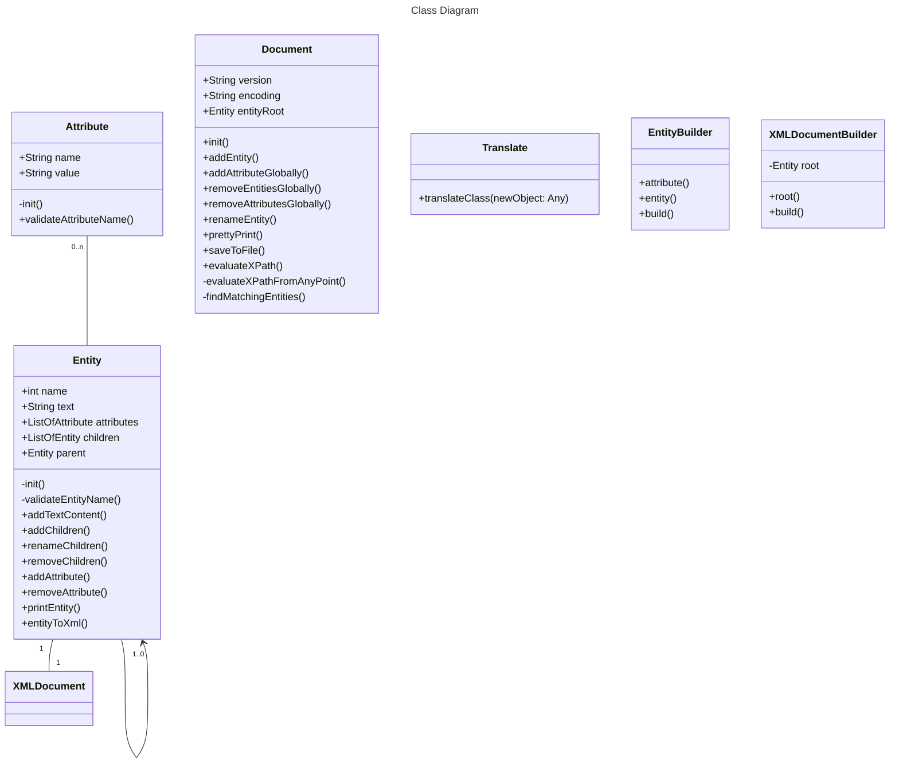

# XML Manipulation Library

---

This library provides functionalities for creating, manipulating, and querying XML documents in Kotlin.
It includes support for creating entities with attributes, adding children entities, and querying the document using a custom implementation of XPath.

---
## Authors

---
Mauro Cardoso # 96014 

Fernando Piedade # 109266

---
## Features

- Create and manage XML entities with attributes.
- Add child entities to existing entities.
- Convert entities and their children to XML string format.
- Query the document using simple XPath expressions.
- Validate entity names to ensure they are XML-compliant.
- Class Annotation - flexibility
- Internal DSL to instantiate XML models intuitively.


<details>
<summary>Class Diagram - Using Image from Drawio</summary>


</details>

<details>
<summary>Class Diagram - Mermeid plugin</summary>


</details>


## Installation

To use this library, include the following installation in your Kotlin project using maven:

| Lib                        | Description                          |
|----------------------------|--------------------------------------|
| `jetbrains.kotlin.reflect` | Library to use in reflection pattern |
| `junit.jupiter`            | Library to use in Unit Test          |


## Usage

### Creating Entities

Entities can be created and managed using the `Entity` class.

```kotlin
val root = Entity("plano").apply {
    addAttribute(Attribute("code", "001"))
}

val fuc = Entity("fuc")
val avaliacao = Entity("avaliacao")

val componente1 = Entity("componente")
componente1.addAttribute(Attribute("nome", "Dissertação"))
componente1.addAttribute(Attribute("peso", "30%"))
componente1.addAttribute(Attribute("nota", "18"))

val componente2 = Entity("componente")
componente2.addAttribute(Attribute("nome", "Apresentação"))
componente2.addAttribute(Attribute("peso", "40%"))
componente2.addAttribute(Attribute("nota", "18"))

val componente3 = Entity("componente")
componente3.addAttribute(Attribute("nome", "Discussão"))
componente3.addAttribute(Attribute("peso", "50%"))
componente3.addAttribute(Attribute("nota", "18"))

avaliacao.addChildren(componente1)
avaliacao.addChildren(componente2)
avaliacao.addChildren(componente3)
root.addChildren(avaliacao)
```

### Creating the Document

The `Document` class is used to manage the root entity and provides functionalities to manipulate and query the document.

```kotlin
val document = Document("1.0", "UTF-8", entityRoot)
```

### Pretty Printing the Document

You can pretty print the document to get its XML string representation.

```kotlin
val xmlString = document.prettyPrint()
println(xmlString)
```

### Querying with XPath

The `XPathProcessor` class provides a method to query the document using simple XPath expressions.

```kotlin
val xPathProcessor = XPathProcessor(document)

val xPathExpression = "fuc/avaliacao/componente"
val result = xPathProcessor.evaluateXPath(xPathExpression)
println("Micro-XPath for this expression: '$xPathExpression':")
result.forEach { println(it.entityToXml()) }
```

### Validating Entity Names

Entity names are validated using a regular expression to ensure they are XML-compliant. This validation is done in the `Entity` class.

```kotlin
class Entity(name: String) {
    init {
        if (!validateEntityName(name)) {
            throw IllegalArgumentException("The name of the entity is invalid.")
        }
    }

    private fun validateEntityName(name: String): Boolean {
        val regex = Regex("[a-zA-Z0-9_-]+") // Allows alphanumeric characters, underscores, and dash
        return regex.matches(name)
    }
}
```

### DSL
Internal DSL to instantiate XML models intuitively.

```kotlin
val document = xmlDocument {
   root("fuc") {
      attribute("code", "mei24")
      entity("avaliacao") {
         entity("componente") {
            attribute("nome", "Dissertação")
            attribute("peso", "30%")
            attribute("nota", "18")
         }
         entity("componente") {
            attribute("nome", "Apresentação")
            attribute("peso", "40%")
            attribute("nota", "18")
         }
         entity("componente") {
            attribute("nome", "Discussão")
            attribute("peso", "50%")
            attribute("nota", "18")
         }
      }
   }
}

```

## Implementation Details

### Entity Class

The `Entity` class represents an XML element with a name, attributes, children, and a parent.

### XMLDocument Class

The `XMLDocument` class manages the root entity and provides methods for pretty printing, saving to a file, and querying the document using XPath.

### XPathProcessor Class

The `XPathProcessor` class processes XPath expressions to query the document. It uses the `XPathVisitor` class to visit entities and validate their paths against the XPath expression.

### Attribute Class

The `Attribute` class represents an XML attribute with a name and a value.

### Visitor Pattern

The visitor pattern is used to traverse the document and perform operations on entities.

### Entity Name Validation

Entity names are validated using a regular expression to ensure they are XML-compliant.

## License

This library is open-source and available under the MIT License.

---
# Functionalities completed
<details>
<summary>Phase 1 - Models</summary>

Develop classes to represent XML in memory (model), operations handling, and testing.

- [x] add and remove entities
- [x] add, remove, and change attributes on entities
- [x] access the parent entity and child entities of an entity
- [x] pretty print in String format, and written to file
- [x] scanning the document with visitor objects (Visitor)
- [x] add attributes globally to the document(providing entity name, attribute name and value)
- [x] Renaming entities globally to the document (providing old name and new name)
- [x] Renaming attributes globally to the document (providing entity name, old name and new attribute name)
- [x] removing entities globally from the document (providing name)
- [x] removing attributes globally from the document(providing entity name, and attribute name)
</details>

<details>
<summary>Phase 2 - Classes-XML Mapping using Annotation</summary>

- [x] add attributes globally to the document(providing entity name, attribute name and value)
- [x] Renaming entities globally to the document (providing old name and new name)
- [x] Renaming attributes globally to the document (providing entity name, old name and new attribute name)
- [x] removing entities globally from the document (providing name)
- [x] removing attributes globally from the document(providing entity name, and attribute name)
</details>

<details>
<summary>Phase 3 - DSL</summary>

- [x] Internal DSL to instantiate XML models intuitively.

</details>

<details>
<summary>Phase 4 - Publish</summary>

- [x] Make the library publicly available with documentation and tutorials..

</details>

---

This `README.md` file includes comprehensive information about the XML manipulation library, along with code examples demonstrating how to create and manipulate XML entities, query the document using XPath, and validate entity names.ibrary
